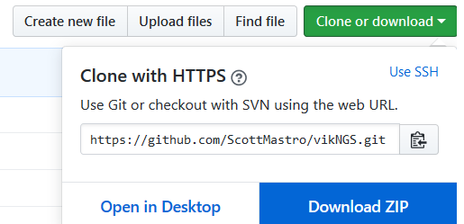

Quick Start
==================================

Installing Software
------------------------------

The `Release folder <https://github.com/ScottMastro/vikNGS/tree/master/Release>`_ of the VikNGS GitHub repository contains precompiled versions of VikNGS for Windows, Mac and Linux operating systems.

TODO

Generating Input Files
------------------------------

Running User Interface
------------------------------

Running Command Line
------------------------------
