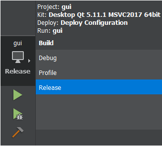

.. _source_code:

Source Code
==================================

Compiling the VikNGS User Interface
------------------------------

The VikNGS source code is contained in ``VikNGS/src/`` and the files specific to the graphical user interface (GUI) are found in ``VikNGS/src/gui``. To build the GUI version of the software, we recommend downloading and installing `QT 5.11+ and QT Creator <http://doc.qt.io/qt-5/index.html>`_. 

Open QT Creator after downloading and press the "Open Project" button to load the user interface QT project. Navigate to the directory where the VikNGS was downloaded and load the file ``VikNGS/src/gui/gui.pro``. This should load the source code and prompt you to choose a compiler. After selecting a compiler, the program can be build by switching to "Release" mode and pressing the top green arrow as seen below:

This should begin compiling the code (will take a few minutes) and will automatically open a window when it is complete.

Compiling the VikNGS Command Line Tool
------------------------------

The command line-specific files are contained in ``VikNGS/src/cmd``. A Makefile is provided to compile the code for command line use and can be found in ``VikNGS/bin``. Simply going into this ``bin`` directory and typing ``make`` from the command line will begin compiling the code.

.. note:: g++ and C++11 or later is required.
